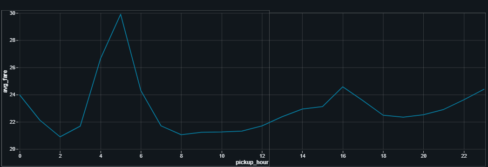

# Documentación del Procesamiento de Datos de Taxis en Databricks

## ⚔️ Introducción

Este documento describe el proceso de carga, limpieza, transformación y almacenamiento de datos de **taxis amarrillos** en Databricks utilizando Delta Lake. El proyecto consistió en cargar datos de taxis desde archivos CSV, limpiarlos y transformarlos, y finalmente guardarlos en formato Delta para su posterior análisis.

## ⬆️ 0. Subida de archivos csv locales a un volumen

Una vez extraídos los datos a través del notebook [`extraccion.ipynb`](./extraccion.ipynb) subimos los 10 CSV a un volumen dentro del apartado de data ingestion de la web de Databricks.

## 🪫 1. Carga de Datos

Primero, cargué los datos desde el volumen de Databricks que contenía los archivos CSV de taxis:

```python
from pyspark.sql import SparkSession

# Crea una sesión de Spark o reutiliza una existente.
spark = SparkSession.builder.getOrCreate()

# Ruta donde están los archivos chunk_01.csv, chunk_02.csv, ...
input_path = "/Volumes/workspace/default/data-taxi/chunk_*.csv"

# Lee los archivos CSV como un solo DataFrame
df = spark.read.option("header", True).option("inferSchema", True).csv(input_path)
```

Este paso me permitió cargar todos los archivos CSV disponibles en un único DataFrame para su procesamiento unificado.

## 👀 2. Visualizacion de los datos y posibles problemas

Después de cargar los datos, visualicé los datos para analizar cómo estaban estructurados y ver las transformaciones necesarias.

Visualizaciones básicas:

```python
display(df) # Muestra el contenido del DataFrame de forma tabular en un entorno interactivo como Databricks o Jupyter.
df.count() # Devuelve el número total de filas (registros) en el DataFrame.
df.printSchema() # Muestra la estructura del DataFrame, incluyendo los nombres de las columnas, sus tipos de datos y si pueden ser nulas.
```

Visualización de Nulos:

```python
from pyspark.sql.functions import col, sum as _sum, when

# Calcula la cantidad de valores nulos por columna en el DataFrame.
# Para cada columna `c`, se aplica una condición que evalúa si el valor es nulo.
# Si es nulo, cuenta 1; de lo contrario, cuenta 0. Luego, se suman los resultados por columna.
# El resultado es un DataFrame con una sola fila donde cada columna indica cuántos valores nulos tiene esa columna original.
null_counts = df.select([
    _sum(when(col(c).isNull(), 1).otherwise(0)).alias(c)
    for c in df.columns
])

# Muestra el DataFrame resultante que contiene el conteo de nulos por cada columna del DataFrame original.
display(null_counts)
```

| VendorID | tpep_pickup_datetime | tpep_dropoff_datetime | passenger_count | trip_distance | RatecodeID | store_and_fwd_flag | PULocationID | DOLocationID | payment_type | payment_type | fare_amount | extra | mta_tax | tip_amount | tolls_amount | improvement_surcharge | total_amount | congestion_surcharge | airport_fee |
| -------- | -------------------- | --------------------- | --------------- | ------------- | ---------- | ------------------ | ------------ | ------------ | ------------ | ------------ | ----------- | ----- | ------- | ---------- | ------------ | --------------------- | ------------ | -------------------- | ----------- |
| 0        | 0                    | 0                     | 7602994         | 0             | 7602994    | 7602994            | 0            | 0            | 0            | 0            | 0           | 0     | 0       | 0          | 0            | 0                     | 0            | 7602994              | 35604821    |

Visualización de Outliers:

```python
# Seleccionar solo columnas numéricas
numeric_cols = [col for col, dtype in df.dtypes if dtype in ("double", "int")]

# Mostrar lista si quieres verla
print("Columnas numéricas:", numeric_cols)

# Muestreo del 1%
sample_df = df.select(numeric_cols).sample(0.01, seed=42).toPandas()

import matplotlib.pyplot as plt
import seaborn as sns

plt.figure(figsize=(15, 6))
sns.boxplot(data=sample_df[numeric_cols])
plt.title("Distribución de columnas numéricas (muestra 1%)")
plt.xticks(rotation=45)
plt.tight_layout()
plt.show()
```


## 🧹 3. Limpieza y Transformación de Datos

Después de cargar los datos, realicé varias transformaciones para limpiarlos:

```python
df = (
    df.filter(col("tpep_pickup_datetime").isNotNull())
    .filter(col("tpep_dropoff_datetime").isNotNull())
    .filter(col("passenger_count") > 0)
    .filter(col("trip_distance") > 0)
    .filter(col("fare_amount") >= 0)
)

# Eliminar columna 'ratecodeid', 'vendorid' y 'airport_fee' ya que son identificadores y no aportan información interesante
df = df.drop('ratecodeid')
df = df.drop('vendorid')
df = df.drop('airport_fee')
```

Las operaciones de limpieza incluyeron:

- Eliminación de registros con fechas nulas
- Filtrado de registros con valores inválidos (pasajeros <= 0, distancia <= 0, tarifa < 0)
- Eliminación de columnas innecesarias

## 🔎 4. Tratamiento de Outliers y Valores Nulos

Para controlar los Outliers no pude evaluarlos adecuadamente debido al gran volumen de datos, solo pude visualizar una muestra del 1%, lo cual dificultó su evaluación de los datos, por esto solo trabaje los nulos de la unica columna que se veia claramente que tenia muchos valores nulos

```python
from pyspark.sql import SparkSession
from pyspark.sql.functions import col

columna = "trip_distance"
# Calcular Q1 y Q3
quantiles = df.approxQuantile(columna , [0.25, 0.75], 0.01)
q1, q3 = quantiles[0], quantiles[1]
iqr = q3 - q1

# Definir límites inferior y superior
lower_bound = q1 - 1.5 * iqr
upper_bound = q3 + 1.5 * iqr

# Filtrar los outliers
df_sin_outliers = df.filter((col(columna) >= lower_bound) & (col(columna) <= upper_bound))
```


Se podría haber realizado un estudio de los outliers mucho mas complejo pero ante la falta de tiempo y la limitación de la web decidí hacer un analisis basico y simple.

Para manejar los valores nulos, simplemente borre todo tipo de nulos ya que la cantidad de datos era lo suficientemente grande para permitirmelo:

1. Eliminar nulos en todas las columnas

```python
df_limpio = df_sin_outliers.dropna()
```

Eliminé todos los registros con valores nulos ya que con tanta cantidad de datos era difícil evaluar si realmente eran esenciales.

## ➕ 5. Creación de Agregados

*(Es necesario haber creado previamente la columna 'pickup_hour' que almacena las horas del dia en tipo string)*

```python
from pyspark.sql.functions import col, to_timestamp, hour

# Limpieza básica del DataFrame:
# 1. Convierte las columnas de fecha y hora de recogida y entrega de tipo string a tipo timestamp.
# 2. Elimina las filas donde la columna de recogida es nula.
# 3. Filtra solo los registros con al menos un pasajero.
df_limpio = (
    df.withColumn("pickup_datetime", to_timestamp(col("tpep_pickup_datetime")))
      .withColumn("dropoff_datetime", to_timestamp(col("tpep_dropoff_datetime")))
      .filter(col("pickup_datetime").isNotNull())
      .filter(col("passenger_count") > 0)
)

# Agrega una nueva columna `pickup_hour` que extrae la hora (en formato 0–23) del timestamp de recogida.
df_limpio = df_limpio.withColumn("pickup_hour", hour("pickup_datetime"))

```

Para facilitar los análisis comunes, creé un DataFrame agregado por hora:

```python
agg_df = df_limpio.groupBy("pickup_hour").agg({"fare_amount": "avg", "trip_distance": "avg", "passenger_count": "sum"}).withColumnRenamed("avg(fare_amount)", "avg_fare").withColumnRenamed("avg(trip_distance)", "avg_distance").withColumnRenamed("sum(passenger_count)", "total_passengers")
```

Este DataFrame agregado me permite analizar rápidamente patrones por hora del día sin necesidad de consultar todo el conjunto de datos.

## 🌊 6. Almacenamiento en Delta Lake

Guardé tanto el DataFrame limpio como los agregados en formato Delta:

```python
agg_df.write.format("delta").mode("overwrite").saveAsTable("agg_df_delta")
df_limpio.write.format("delta").mode("overwrite").saveAsTable("df_limpio_delta")
```

Delta Lake me proporciona varias ventajas:

- ACID transactions
- Historial de versiones (Time Travel)
- Optimizaciones de rendimiento
- Aplicación de esquema

## 🚀 7. Visualizaciones

Finalmente realicé algunas visualizaciones una vez procesado todos los datos, estas visualizaciones son las que luego se mostraran en el dashboard.

### 📊 1. Promedio de tarifa por hora del día



### 📊 2. Total de pasajeros por hora


### 📊 3. Distancia media recorrida por hora


## ⚠️ Mejoras por implementar

Dado a la falta de tiempo quedó por implementar varias funciones que mejorarian la automatización de este proyecto, las cuales se podrian aplicar en un futuro, estas son:

* Ingesta de Múltiples Archivos y Pipeline Incremental
* Automatización con Triggers

## 🫵 Conclusiones

Gracias a este proceso, pude manejar de forma eficiente un gran conjunto de datos de taxis y almacenarlos en un formato optimizado para análisis. La integración con Delta Lake aporta múltiples beneficios cuando se trabaja a gran escala, los puntos aprendidos en este proyecto fueron:

- Procesamiento eficiente de grandes volúmenes de datos
- Limpieza y preparación de datos exitosa
- Almacenamiento optimizado con Delta Lake
- Visualizacion de los datos

Con estos pasos completados, los datos están preparados para análisis más profundos, creación de visualizaciones y potencial uso en modelos de machine learning.
