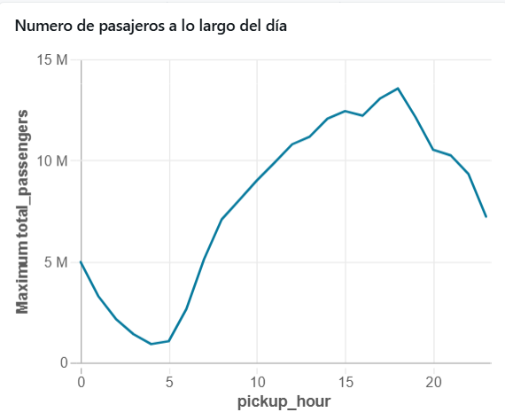
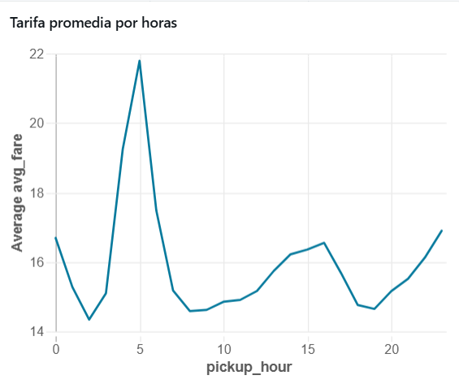
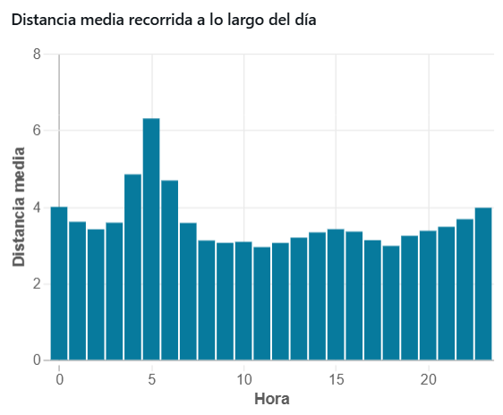

# :star: Documentación Ingesta y procesamiento de Datos de Taxis

## Introducción al proyecto

Este proyecto implementa el ciclo completo de ETL utilizando PySpark sobre Databricks Community Edition. El objetivo es comprender el comportamiento de los viajes de taxi cada día durante el período de 2020-2024.

El proyecto consiste de: 

1. Ingestar archivos con datos mensuales desde 2020 hasta 2024.

2. Limpieza y transformación de datos.
   * Tratamiento de nulos y valores invalidos
   * Transformación de formatos
   * Eliminación de columnas innecesarias

3. Agregar métricas útiles.

4. Guardar los datos procesados en Delta Lake.

5. Implementar un pipeline para ingesta incremental de datos.

6. Construir un dashboard visual con insights clave:
   * Horas con más pasajeros.
   * Tarifas promedio.
   * Distancias recorridas.

Los datos se tomaron de [NYC Taxi and Limousine Commission](https://www.nyc.gov/site/tlc/about/tlc-trip-record-data.page).


# :department_store: 1. Ingesta de datos

Lo primero fue descargar los datos de taxis y guardarlos en archivos CSV para poder cargarlos. La alternativa de web scrapping no me resultó cómoda debido al tamaño de los archivos y a las limitaciones de la versión de prueba de Databricks.

Usando la función de Data Ingesting de Databricks, cargué los archivos a un volumen y guardé esos datos en un dataframe.

```python
# Definir la ruta del volumen
ruta_volumen = "/Volumes/workspace/default/data-taxi"
 
# Listar todos los archivos del volumen y filtrar solo los CSV
archivos = dbutils.fs.ls(ruta_volumen)
archivos_csv = [archivo.path for archivo in archivos if archivo.path.endswith('.csv')]
 
# Guardar los datos en un dataframe
if archivos_csv:
    df_taxis = spark.read.option("header", "true").option("inferSchema", "true").csv(archivos_csv)
    
    # Verificar si el DataFrame se cargó correctamente
    print(f"\nDataFrame cargado con {df_taxis.count()} registros")
    print("\nEsquema del DataFrame:")
    df_taxis.printSchema()
    
    print("\nPrimeras 5 filas:")
    display(df_taxis.limit(5))
else:
    print("No se encontraron archivos csv en el volumen.")
```

# :broom: 2. Limpieza y transformación de datos

Con los datos ya ingestados, realicé varias transformaciones básicas.

```python
df_clean = (
    df_taxis.withColumn("pickup_datetime", to_timestamp(col("tpep_pickup_datetime")))
    .withColumn("dropoff_datetime", to_timestamp(col("tpep_dropoff_datetime")))
    .filter(col("pickup_datetime").isNotNull())
    .filter(col("dropoff_datetime").isNotNull())
    .filter(col("passenger_count") > 0)
    .filter(col("trip_distance") > 0)
    .filter(col("fare_amount") >= 0)
    .withColumn("pickup_hour", hour("pickup_datetime"))
)

df_clean = df_clean.drop("airport_fee", "store_and_fwd_flag")
display(df_clean)
```
Operaciones realizadas:
1. Conversión de fechas a formato timestamps
2. Filtrado de valores nulos o inválidos (p.e. viajes sin pasajeros)
3. Extracción de la hora de recogida para usar luego en análisis
4. Eliminación de columnas irrelevantes

# :cherries: 3. Agregación de métricas útiles

Para poder hacer el análisis por día más eficiente, añadí varias métricas nuevas:
- Tarifa promedio por hora
- Distancia promedia por hora
- Total de pasajeros por hora

```python
df_agg = df_clean.groupBy("pickup_hour").agg(
{"fare_amount": "avg", "trip_distance": "avg", "passenger_count": "sum"}).withColumnRenamed("avg(fare_amount)", "avg_fare").withColumnRenamed("avg(trip_distance)", "avg_distance").withColumnRenamed("sum(passenger_count)", "total_passengers")
```

# :ocean: 4. Almacenamiento en Delta Lake

Guardé dos versiones de mi dataframe en un Delta Lake, una con las métricas nuevas y otra sin ellas.
La ventaja principal de usar Delta Lake en mi proyecto es el poder usar operaciones transaccionales y el mantenimiento incremental de los datos.

```python
df_agg.write.format("delta").mode("overwrite").saveAsTable("df_agregados")
df_clean.write.format("delta").mode("overwrite").saveAsTable("df_clean")
```

# :arrow_upper_right: 5. Implementación de un Pipeline

Cree una función para ingestar nuevos datos incrementalmente.

```python
# Función para procesar nuevos datos e incorporarlos a Delta
def procesar_e_ingerir_datos(ruta_origen, tabla_destino):
    """
    Procesa nuevos archivos CSV y los añade a una tabla Delta existente.

    Args:
        ruta_origen (str): Ruta donde se encuentran los nuevos archivos CSV
        tabla_destino (str): Nombre de la tabla Delta donde se añadirán los datos

    Returns:
        int: Número de registros procesados y añadidos
    """
    # Leer nuevos datos
    nuevos_datos = spark.read.option("header", True).schema(schema).csv(ruta_origen)

    # Aplicar las mismas transformaciones
    nuevos_datos_procesados = (
        nuevos_datos.withColumn("pickup_datetime", to_timestamp(col("tpep_pickup_datetime")))
        .withColumn("dropoff_datetime", to_timestamp(col("tpep_dropoff_datetime")))
        .filter(col("pickup_datetime").isNotNull())
        .filter(col("passenger_count") > 0)
        .filter(col("trip_distance") > 0)
        .filter(col("fare_amount") >= 0)
        .withColumn("pickup_hour", hour("pickup_datetime"))
    )

    # Guardar en formato Delta (modo append para añadir a los datos existentes)
    nuevos_datos_procesados.write \
        .format("delta") \
        .mode("append") \
        .saveAsTable(tabla_destino)

    return nuevos_datos_procesados.count()
```

# :bar_chart: 6. Dashboard con los resultados







# :end: Conclusiones finales

Este proyecto me a permitido manejar un volumen considerable de datos de manera rápida y analizarlos para sacar insights interesantes. El almacenamiento con Delta Lake hizo el consultar las tablas para generar el dashboard más sencillo.